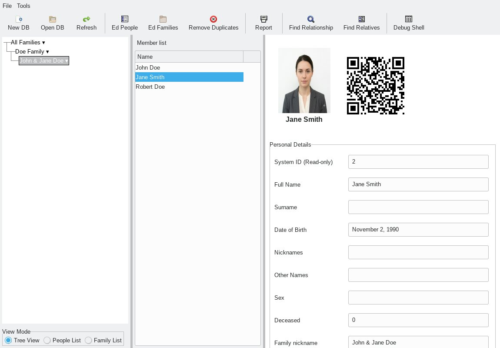

# Gene-Pro genelogy tool
### IMPORTANT:
    Most of this script is generated using Google Gemini
    Keep in mind: Gemini is AI and can make mistakes. 

### From The Devil's Dictionary (1881-1906) [devil]:
  GENEALOGY, n.  An account of one's descent from an ancestor who did
  not particularly care to trace his own.

## Features:
    
    - sqlite3 / sqlcipher ( with encryption ) backend
    - wx gui / cli modes
    - Family network graph using networkx ( with optional member list )
    - Report generation in html / pdf ( latex ) 
             * with hyperlinked contents and full index
             * support `confidential_fields` exclusion
    - QR coded vcard support in reports
    - Report generation for entire tree or any branch 
    - Relationship calculator output image with graph and textual description
    - Import and Export:
             * sql dump
             * json
             * gedcom
             * vCards
             * sqlite3 / sqlcipher db
    - Table editors for people and family
    - Optional debugger panel

 

## Usage:
1. Clone the repository
```
git clone --depth 1 https://github.com/gv1/gene-pro
[main.zip](https://github.com/gv1/gene_pro/archive/refs/heads/main.zip)
```
2. Install the required dependencies:
cd gene-pro
```
pi install -r requirements.txt
```
3. To launch the application, run the following command from your terminal:
`python genealogy.py`

### start gui:
```
python genealogy.py
python genealogy.py -e sqlite3 -g -d family.db
```

### report generation from command line:
```
python genealogy.py -c --report --group "All Families" -r -d family.db
```

### Generate PDF and html reports:
Creates report.html and related files in Fami* directories

### To generate pdf from tex file generated:
Run pdflatex twice
```
cd Famil*; 
pdflatex report.tex 
pdflatex report.tex
```

```
python genealogy.py -h
usage: genealogy.py [-h] [-p PASSWORD] [-e {sqlite3,sqlcipher}] [-d DB] [-v [VERBOSE]] [-i INPUT]
                    [-o OUTPUT] [-f {csv,gedcom,json,jpg,jpeg,png,tex}] [-r] [--debug-panel]
                    [--report] [--group GROUP] [--branch BRANCH]
                    [--export-graph {graphml,gexf,gml}] [--relationship RELATIONSHIP] [-c | -g]
                    [--import-file IMPORT_FILE] [--export-data EXPORT_DATA]

Genealogy Data Utility

options:
  -h, --help            show this help message and exit
  -p, --password PASSWORD
                        Password for SQLCipher database
  -e, --engine {sqlite3,sqlcipher}
                        Engine: sqlite3 (default) or sqlcipher
  -d, --db DB           Path to database file
  -v, --verbose [VERBOSE]
                        Enable debug logging (optional level int, defaults to 2 if flag used)
  -i, --input INPUT     Input file path (Legacy)
  -o, --output OUTPUT   Output file path (Legacy)
  -f, --format {csv,gedcom,json,jpg,jpeg,png,tex}
                        File format for export or graphing
  -r, --readonly        Boot up database structure in safe Read-Only mode
  --debug-panel         Boot up with the unified bottom interactive debugger shell active
  --report              Generate a family report
  --group GROUP         Specify a target Family Group
  --branch BRANCH       Specify a target Sub-Branch
  --export-graph {graphml,gexf,gml}
                        Export a network graph for a group
  --relationship RELATIONSHIP
                        Calculate relationship. Usage: id1,id2
  -c, --cli             Command line only mode
  -g, --gui             Graphical user interface (default)
  --import-file IMPORT_FILE
                        Import data. Usage: file.ged, .json, .vcf, .sql, or 'basepath' for CSVs
  --export-data EXPORT_DATA
                        Export data. Usage: file.ged, .json, .vcf, .sql, or 'basepath' for CSVs

```
*last updated: 2026-06-24 10:15:00 IST*
